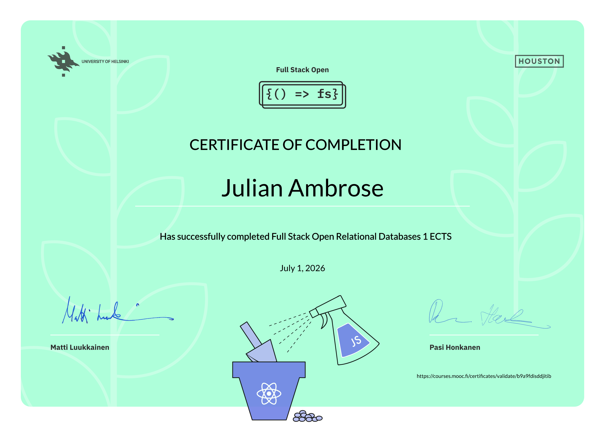

# Relational Databases
A collection of exercises completed as part of Full Stack Open, part 13. The exercises cover relational databases, SQL, PostgreSQL, database design, working with database relationships, and integrating relational databases with backend applications.

## Course Completion Certificate
